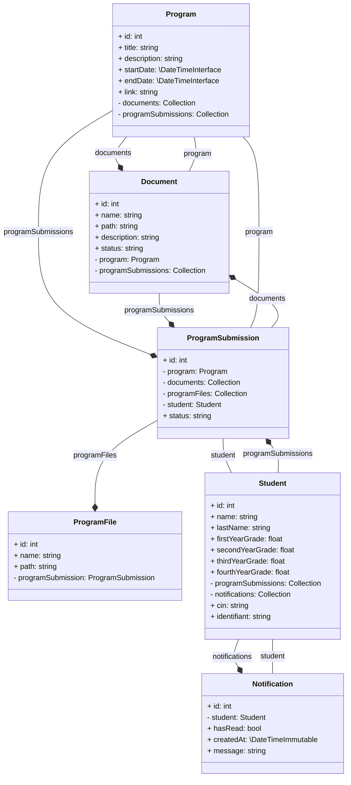
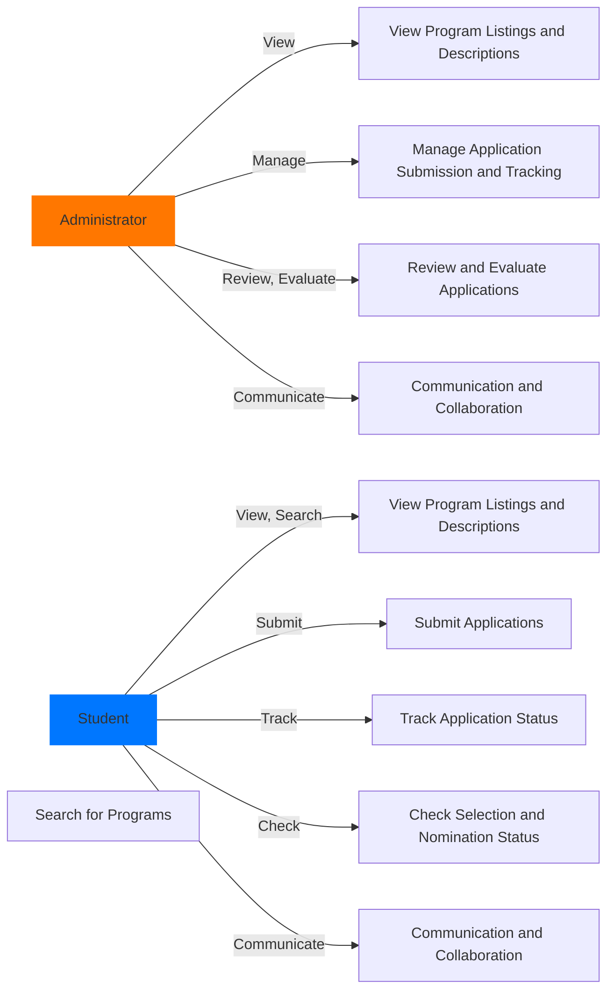

# International_Study_Mobility_Management

## Description
The context of the project revolves around the management of international study mobility. This entails facilitating the dissemination of international study mobility offers,
collecting applications and their information, as well as the manual selection and nomination process. Currently, these processes are carried out manually, which can be timeconsuming, inefficient, and prone to errors. To address these challenges, the development of a platform for the management of international study mobility is proposed.

## Class Diagram

## Genral Use Case

