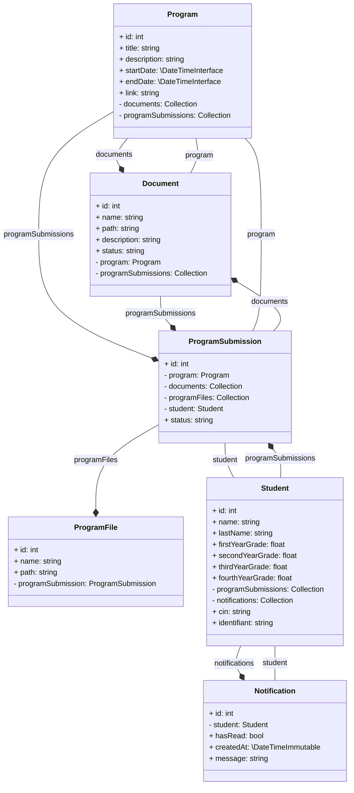

```mermaid
classDiagram
    class Program {
        + id: int
        + title: string
        + description: string
        + startDate: \DateTimeInterface
        + endDate: \DateTimeInterface
        + link: string
        - documents: Collection<Document>
        - programSubmissions: Collection<ProgramSubmission>
    }

    class Document {
        + id: int
        + name: string
        + path: string
        + description: string
        + status: string
        - program: Program
        - programSubmissions: Collection<ProgramSubmission>
    }

    class ProgramSubmission {
        + id: int
        - program: Program
        - documents: Collection<Document>
        - programFiles: Collection<ProgramFile>
        - student: Student
        + status: string
    }

    class ProgramFile {
        + id: int
        + name: string
        + path: string
        - programSubmission: ProgramSubmission
    }

    class Student {
        + id: int
        + name: string
        + lastName: string
        + firstYearGrade: float
        + secondYearGrade: float
        + thirdYearGrade: float
        + fourthYearGrade: float
        - programSubmissions: Collection<ProgramSubmission>
        - notifications: Collection<Notification>
        + cin: string
        + identifiant: string
    }

    class Notification {
        + id: int
        - student: Student
        + hasRead: bool
        + createdAt: \DateTimeImmutable
        + message: string
    }

    Program --* Document : documents
    Program --* ProgramSubmission : programSubmissions
    Document -- Program : program
    Document --* ProgramSubmission : programSubmissions
    ProgramSubmission -- Program : program
    ProgramSubmission --* Document : documents
    ProgramSubmission --* ProgramFile : programFiles
    ProgramSubmission -- Student : student
    Student --* ProgramSubmission : programSubmissions
    Student --* Notification : notifications
    Notification -- Student : student
```
