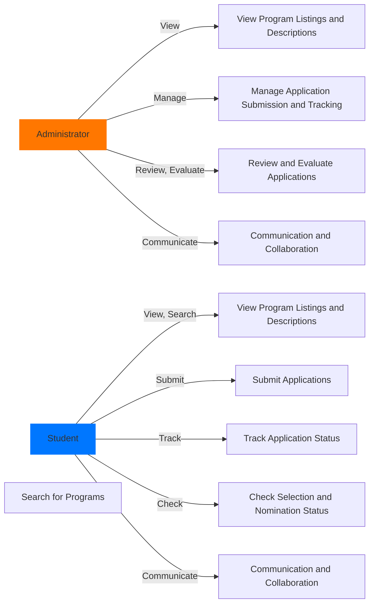

```mermaid
graph LR
  style Admin fill:#FF7700,stroke:#FF7700
  style Student fill:#0077FF,stroke:#0077FF

  Admin[Administrator]
  View_ProgramDescriptions[View Program Listings and Descriptions]
  Manage_Applications[Manage Application Submission and Tracking]
  Review_Evaluate[Review and Evaluate Applications]
  Communicate[Communication and Collaboration]

  Student[Student]
  View_ProgramDescriptions2[View Program Listings and Descriptions]
  Search_Programs[Search for Programs]
  Submit_Applications[Submit Applications]
  Track_Applications[Track Application Status]
  Check_Status[Check Selection and Nomination Status]
  Communicate2[Communication and Collaboration]

  Admin -->|View| View_ProgramDescriptions
  Admin -->|Manage| Manage_Applications
  Admin -->|Review, Evaluate| Review_Evaluate
  Admin -->|Communicate| Communicate

  Student -->|View, Search| View_ProgramDescriptions2
  Student -->|Submit| Submit_Applications
  Student -->|Track| Track_Applications
  Student -->|Check| Check_Status
  Student -->|Communicate| Communicate2
```
